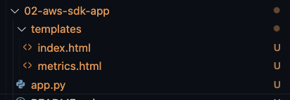

# Integración del AWS SDK con Python

## Descripción

Durante este ejercicio se desplegará una aplicación de Flask que nos permitirá conocer el estatus de las instancias de EC2 que tengamos inicializadas, así como poder realizar acciones con ellas (Encendido y apagado).

## Objetivo del ejericio
El objetivo de este ejercicio es conocer la herramienta del AWS CDK, conocido como **boto3** en su versión para Python. Esta biblioteca nos permite controlar nuestros componentes de infraestructura y servicios en la nube de Amazon Web Services.

## Requisitos previos

Revisar los pasos del 3 al 6 de la sección de instrucciones del ejercicio 1 para crear un entorno local de Python e instalar la biblioteca de Flask, de preferencia, ejecutar esto en un entorno local.

## Instrucciones

1. Instalar la biblioteca **boto3** para integrarla dentro de nuestra aplicación de Flask.

   ```bash
   pip install boto3
   ```

2. Asegurarse que en el proyecto se contengan los templates _index.html_ y _metrics.html_, así como la aplicación app.py tal como se encuentran en esta carpeta del repositorio.

   

3. Ejecutar el proyecto utilizando el comando `python app.py`.
4. Una vez corriendo el proyecto, se debería visualizar como en las siguientes capturas.

    2.15.03 p.m..png>)
    2.15.07 p.m..png>)

5. Prepara tu proyecto para publicarlo en tu instancia de **EC2**.
