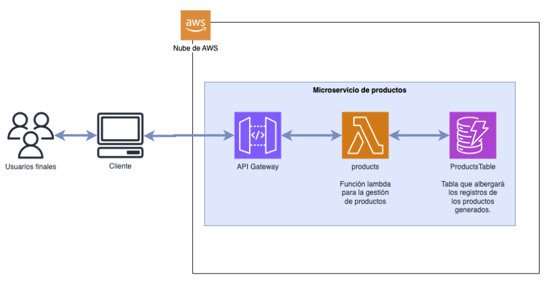

# Proyecto final: Desarrollo de microservicio de productos

## Descripción general

Desarrollar una infraestructura de microservicio que permita realizar operaciones CRUD en una tabla de productos que pueda ser integrada en una plataforma de tienda en línea. La arquitectura propuesta debe ser como la que se muestra a continuación:

El objetivo del ejercicio es poder realizar las siguientes acciones mediante endpoints de AWS API Gateway:

- **Crear productos:** Crear productos en la base de datos a partir de los datos recibidos en el endpoint. Los productos deben contar al menos con un SKU, nombre, descripción y precio.
- **Editar producto:** Se recibe el SKU del producto como parámetro y se envía un listado de atributos que permitan actualizar el valor del registro en la base de datos.
- **Lista de productos:** No recibe parámetros y devuelve una lista con todos los productos ordenados por `fecha_creacion` del más reciente al más antiguo.
- **Detalle de producto:** Recibe el SKU del producto como parámetro y devuelve todos los atributos de este.
- **Eliminar producto:** Recibe el SKU del producto y elimina el producto si este existe en la base de datos.

## Requisitos Técnicos

### API Gateway

El proyecto debe contar con una API con cinco endpoints, uno para cada acción.

### AWS Lambda

El proyecto debe contar con solo una función Lambda que permita realizar las cinco operaciones. La función Lambda debe tener la capacidad de identificar cuál fue el endpoint llamado mediante información del evento pasado a la función Lambda. El lenguaje del runtime de la Lambda es de libre elección.

### DynamoDB

La información de los productos debe ser almacenada utilizando una sola tabla. La tabla creada debe encontrarse en el modo de CAPACIDAD BAJO DEMANDA. La tabla debe contar con el atributo SKU como Partition Key (PK) y `fecha_creacion` como Sort Key (SK). Cada producto debe contener al menos los atributos de:

- Nombre
- Descripción
- Precio

## Instrucciones de Entrega

La entrega debe hacerse en un archivo comprimido con extensión ZIP. Este debe contar con lo siguiente:

1. **Documento de especificación:** Debe contener la URL de la API, los endpoints para poder hacer llamados, así como cualquier otro dato necesario para poder ejecutar la función Lambda. Este documento puede reemplazarse por una colección de Postman con la configuración de los endpoints correcta.
2. **Carpeta de código de Lambda:** Debe incluir todos los archivos desplegados dentro de la función Lambda en el lenguaje de tu preferencia. Si la carpeta contiene mucha información, se puede reemplazar por un documento con un enlace a un repositorio de Github.

## Consideraciones

- Utilizar la capacidad bajo demanda en la creación de la tabla de DynamoDB.
- Es necesario agregar una política al rol generado por la Lambda para interactuar con la tabla de DynamoDB. Esta política debe permitir realizar cualquier acción de DynamoDB sobre el recurso creado (la tabla de productos).

---

**Desarrollo de aplicaciones en la nube (AWS)**
marzo 2024
